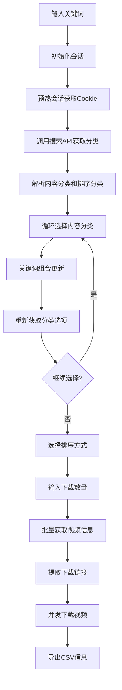

# 抖音视频批量抓取下载工具

一个基于纯 `requests` 库的抖音视频批量抓取和下载工具，支持内容分类选择、排序过滤、高清视频下载等功能。

## 🚀 功能特性

- **纯 requests 实现**：无需浏览器自动化，轻量高效
- **智能分类选择**：支持循环选择内容分类，关键词自动组合
- **排序过滤**：支持综合排序、最新发布、最多点赞等排序方式
- **高清视频下载**：支持1080P、720P等多种清晰度
- **并发下载**：多线程并发下载，提升效率
- **CSV导出**：自动导出视频信息到CSV文件
- **Cookie管理**：支持登录Cookie注入，获取高清内容

## 📚 依赖库

```python
# 核心库
requests                    # HTTP请求库
pathlib                    # 路径处理
urllib.parse              # URL解析和编码
json                      # JSON数据处理
csv                       # CSV文件操作
time                      # 时间处理
re                        # 正则表达式
random                    # 随机数生成
string                    # 字符串处理

# 类型提示
typing                    # 类型注解支持

# 并发处理
concurrent.futures        # 线程池执行器
threading                 # 线程管理
collections               # 集合数据类型

# 网络适配器
requests.adapters         # HTTP适配器和重试机制
```

## 🏗️ 代码整体结构

### 1. 配置常量
```python
# API端点
SEARCH_API_URL = "https://www.douyin.com/aweme/v1/web/general/search/single/"
DETAIL_API_URL = "https://www.douyin.com/aweme/v1/web/aweme/detail/"
SEARCH_ITEM_API_URL = "https://www.douyin.com/aweme/v1/web/search/item/"

# 目录配置
EXPORT_DIR_NAME = "export"           # 导出目录
DOWNLOADS_DIR_NAME = "downloads"     # 下载目录
DEBUG_DIR_NAME = "feed_debug"        # 调试目录

# 并发配置
MAX_PARSE_CONCURRENCY = 6            # 解析并发数
MAX_DOWNLOAD_CONCURRENCY = 3         # 下载并发数
```

### 2. 核心功能模块

#### 2.1 会话管理模块
- `session_from_storage_state()`: 从存储状态文件构造requests会话
- `preheat_session()`: 会话预热，获取环境Cookie
- `ensure_ms_token_cookie()`: 确保msToken Cookie存在
- `log_cookie_diagnostics()`: Cookie状态诊断

#### 2.2 API调用模块
- `api_search_item_once()`: 搜索接口调用
- `api_search_once()`: 通用搜索接口
- `api_aweme_detail()`: 视频详情接口
- `_append_x_bogus_if_any()`: X-Bogus签名注入
- `_append_a_bogus_if_any()`: a_bogus签名注入

#### 2.3 分类解析模块
- `extract_categories_from_doodle_config()`: 从global_doodle_config解析分类
- `extract_categories_from_item_response()`: 从API响应解析分类
- `extract_search_categories_from_html()`: 从HTML解析分类

#### 2.4 视频信息提取模块
- `extract_video_info()`: 提取视频下载链接和质量信息
- `deep_find_aweme()`: 深度查找aweme对象
- `extract_awemes_from_parsed()`: 从解析结果提取视频列表

#### 2.5 下载管理模块
- `download_video()`: 单个视频下载
- `requests_fetch_awemes_via_item_api()`: 批量获取视频信息
- `build_csv_writer()`: 构建CSV写入器

### 3. 主要方法调用流程



## 🔧 实现原理

### 1. 纯requests实现策略

#### 1.1 Cookie注入
```python
def session_from_storage_state(state_path: Path) -> requests.Session:
    # 优先加载storage_state.json
    # 回退到cookies.json
    # 自动生成msToken
```

#### 1.2 请求头模拟
```python
headers = {
    'User-Agent': 'Mozilla/5.0 (Windows NT 10.0; Win64; x64) ...',
    'Referer': 'https://www.douyin.com/',
    'Accept': 'application/json, text/plain, */*',
}
```

#### 1.3 签名生成
```python
def generate_signature(qs: str, ua: str) -> str:
    # MD5哈希 + Base64编码
    # 模拟X-Bogus签名
```

### 2. 分类选择机制

#### 2.1 内容分类循环选择
```python
# 支持多次选择，关键词自动组合
# 美女 -> 美女 跳舞 -> 美女 跳舞 热舞
while True:
    # 显示当前关键词和可选分类
    # 用户选择分类或输入-1退出
    # 更新关键词并重新获取分类选项
```

#### 2.2 排序分类选择
```python
# 综合排序、最新发布、最多点赞等
# 应用相应的API参数
```

### 3. 视频质量选择

#### 3.1 清晰度优先级
```python
def _gear_rank(name: Optional[str]) -> int:
    # 4K > 1080P > 720P > 540P > 480P > 360P
    # H.265 > H.264
    # 高码率 > 低码率
```

#### 3.2 最佳质量选择
```python
def _select_best(video_dict: Dict):
    # 遍历bit_rate数组
    # 按质量、编码、码率排序
    # 选择最优下载链接
```

### 4. 并发下载实现

#### 4.1 线程池管理
```python
with ThreadPoolExecutor(max_workers=MAX_DOWNLOAD_CONCURRENCY) as ex:
    # 提交下载任务
    # 等待完成并收集结果
```

#### 4.2 错误处理
```python
def _download_one(i: Dict) -> Optional[Dict]:
    try:
        # 尝试下载
        # 返回下载结果
    except Exception as e:
        # 记录失败信息
        return None
```

## 📁 文件结构

```
抖音搜索关键词批量视频抓取下载/
├── 抖音.py              # 主程序文件
├── README.md            # 说明文档
├── cookies.json         # Cookie配置文件
├── export/              # CSV导出目录
├── downloads/           # 视频下载目录
└── feed_debug/          # 调试信息目录
```

## 🚀 使用方法

### 1. 环境准备
```bash
# 安装依赖
pip install requests

# 准备Cookie文件（可选，用于高清视频）
# 创建cookies.json文件，包含登录Cookie
```

### 2. 运行程序
```bash
python 抖音.py
```

### 3. 操作流程
1. **输入关键词**：如"美女"
2. **选择内容分类**：循环选择，关键词自动组合
3. **选择排序方式**：综合排序、最新发布等
4. **输入下载数量**：指定要下载的视频数量
5. **自动下载**：并发下载并导出CSV

## 🔍 技术特点

### 1. 反爬虫策略
- **Cookie管理**：模拟真实用户登录状态
- **请求头伪装**：完整的浏览器环境信息
- **签名生成**：模拟X-Bogus签名机制
- **延迟控制**：合理的请求间隔

### 2. 容错机制
- **多级回退**：API失败时回退到HTML解析
- **重试机制**：网络请求自动重试
- **异常处理**：完善的错误捕获和处理

### 3. 性能优化
- **并发下载**：多线程提升下载效率
- **智能分页**：自动处理分页逻辑
- **去重机制**：避免重复下载相同视频

## ⚠️ 注意事项

1. **合规使用**：请遵守抖音平台的使用条款
2. **频率控制**：避免过于频繁的请求
3. **Cookie管理**：定期更新Cookie以保持登录状态
4. **存储空间**：确保有足够的磁盘空间存储视频

## 🔧 自定义配置

### 修改并发数
```python
MAX_DOWNLOAD_CONCURRENCY = 5  # 增加下载并发数
MAX_PARSE_CONCURRENCY = 8     # 增加解析并发数
```

### 修改超时设置
```python
REQUEST_TIMEOUT = 30          # 增加请求超时时间
SCROLL_PAUSE_SEC = 2.0       # 增加滚动暂停时间
```

### 修改下载目录
```python
DOWNLOADS_DIR_NAME = "my_videos"  # 自定义下载目录名
```

## 📊 技术难度评估

### 整体难度：⭐⭐⭐⭐☆ (4/5)

#### 1. 反爬虫绕过 ⭐⭐⭐⭐⭐ (5/5)
- **Cookie管理复杂性**：需要处理多种Cookie类型（ttwid、s_v_web_id、msToken等）
- **签名算法破解**：X-Bogus/a_bogus签名机制需要逆向分析JavaScript代码
- **请求头伪装**：需要模拟完整的浏览器环境信息
- **频率控制**：避免触发反爬虫检测机制

#### 2. API逆向分析 ⭐⭐⭐⭐☆ (4/5)
- **接口发现**：需要分析网络请求找到正确的API端点
- **参数构造**：理解复杂的查询参数结构和含义
- **响应解析**：处理嵌套的JSON数据结构
- **分页逻辑**：实现智能的分页和去重机制

#### 3. 视频质量选择 ⭐⭐⭐☆☆ (3/5)
- **清晰度解析**：从bit_rate数组中选择最佳质量
- **编码格式**：区分H.265和H.264编码
- **码率排序**：按质量、编码、码率综合排序
- **下载链接**：处理多种播放地址格式

#### 4. 并发下载实现 ⭐⭐⭐☆☆ (3/5)
- **线程池管理**：使用ThreadPoolExecutor实现并发下载
- **错误处理**：完善的异常捕获和重试机制
- **进度跟踪**：监控下载进度和状态
- **资源管理**：合理控制并发数量避免过载

#### 5. 分类系统设计 ⭐⭐⭐⭐☆ (4/5)
- **分类解析**：从API响应和HTML中提取分类信息
- **循环选择**：实现关键词组合和分类更新
- **状态管理**：维护分类选择状态和参数
- **用户交互**：设计友好的命令行交互界面

### 技术挑战点

#### 🔴 高难度
1. **JavaScript签名逆向**：需要深入分析混淆后的JS代码
2. **Cookie生成逻辑**：理解抖音的Cookie生成机制
3. **API参数加密**：破解请求参数的加密算法

#### 🟡 中难度
1. **分类系统设计**：实现灵活的分类选择和组合
2. **视频质量选择**：优化清晰度和编码选择算法
3. **并发控制**：平衡下载效率和系统资源

#### 🟢 低难度
1. **HTTP请求封装**：使用requests库进行网络请求
2. **文件操作**：CSV导出和文件下载
3. **基础数据结构**：JSON解析和数据处理

### 学习价值

- **反爬虫技术**：学习现代网站的反爬虫机制和绕过方法
- **API逆向**：掌握Web API的逆向分析和调用技巧
- **并发编程**：理解Python多线程编程和资源管理
- **网络协议**：深入了解HTTP协议和Cookie机制
- **数据解析**：学习复杂JSON数据的解析和处理方法

## 📝 更新日志

- **v1.0.0**: 初始版本，支持基本搜索和下载
- **v1.1.0**: 添加内容分类循环选择功能
- **v1.2.0**: 优化视频质量选择算法
- **v1.3.0**: 完善Cookie管理和反爬虫策略

## 🤝 贡献指南

欢迎提交Issue和Pull Request来改进这个工具！

## 📄 许可证

本项目仅供学习和研究使用，请勿用于商业用途。
